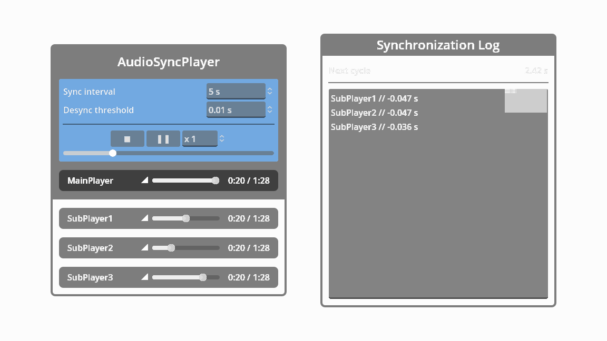

> [!WARNING]
> As of Godot 4.3, the functionalities of this add-on are surpassed by [AudioStreamSynchronized](https://github.com/godotengine/godot/pull/64488).

#  AudioSyncPlayer Nodes

A set of Audio Player nodes that can be synchronized.

## Nodes
-  **AudioSyncPlayer** - Plays an audio stream non-positionally while keeping other AudioStreamPlayer in sync.
-  **AudioSyncPlayer2D** - Plays positional sound in 2D space while keeping other AudioStreamPlayer2D in sync.
-  **AudioSyncPlayer3D** - Plays positional sound in 3D space while keeping other AudioStreamPlayer3D in sync.
  
> [!NOTE]
> Once the add-on is enabled, its documentation can be accessed directly from the Godot IDE (``F1``).
